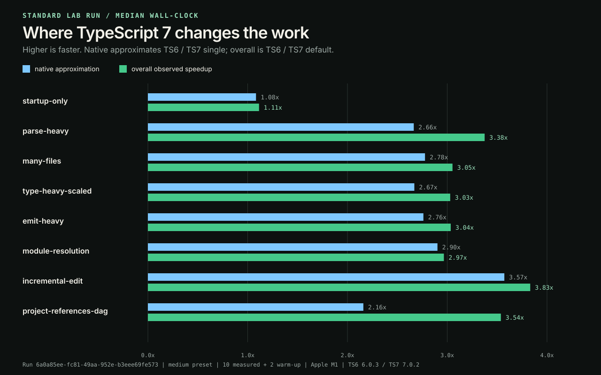
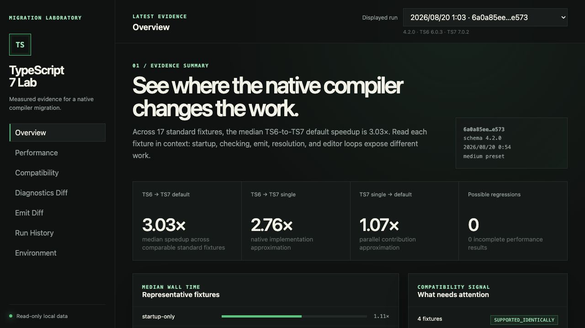

# TypeScript 7 Migration Lab — 最終技術レポート

## 結論

Apple M1の単一環境で行ったmedium presetの標準runでは、17個の比較可能な
fixtureにおけるTS6対TS7 defaultの速度比の中央値は3.03倍だった。その内訳は
TS6対TS7 single-threadedが2.76倍、TS7 single-threaded対defaultが1.07倍である。
このrunでは、並列化よりもnative実装全体の差が大きい。一方、project referencesでは
並列設定に1.64倍の追加効果があり、workloadごとに内訳は異なる。

互換性は、「差があるか」ではなく、diagnostics、exit code、emit、compiler option、
programmatic APIを別々に判断すべきである。通常fixture 4件のdiagnosticsとemit 2件は
一致した。既知のexit codeと廃止optionの差2件は意図された変更として分離でき、
possible regressionは0件だった。ただし、typescript-eslintのようにcompiler APIを使う
toolはTS6との共存が必要である。

したがって移行方針は、「TS7は速いから一括置換」ではない。CLI中心のprojectは
固定versionでpilotを始め、古いoptionを先に移行する。API consumerがあるprojectはTS6/TS7を
併設し、実project adapterで自分のcodebaseを測ってから意思決定するのが妥当である。



## 測定スナップショット

| 項目 | 値 |
|---|---|
| Run ID | `6a0a85ee-fc81-49aa-952e-b3eee69fe573` |
| Lab commit | `3a77bd0437aa8ec0641d15151df6ba8919a36821` |
| 実行日 | 2026-08-20 JST |
| Compiler | TypeScript 6.0.3 / TypeScript 7.0.2 |
| Runtime | Node.js 24.14.0, darwin arm64 |
| Machine | Apple M1, 8 logical CPUs, 16 GiB memory |
| Fixture preset | `medium` |
| 反復 | cold 1回、warm-up 2回、計測10回 /各fixture・variant |
| 実行順 | `rotating-v1` |
| Resource collector | `darwin-time-l`, timed-process scope |
| Timeout | 120000 ms /各compiler invocation |

`medium`は400ファイル、48 parse files、24 type files、80 emit files、80 packages、
160 incremental files、80 watch files、4×3 project-reference DAGを含む。全ての測定値は
成功した10回のmedianであり、coldとwarm-upは統計から除外した。

## 性能で分かったこと

| Fixture | TS6 | TS7 single | TS7 default | Native概算 | Parallel概算 | 全体 |
|---|---:|---:|---:|---:|---:|---:|
| startup-only | 59.9 ms | 55.3 ms | 53.8 ms | 1.08x | 1.03x | 1.11x |
| parse-heavy | 455.3 ms | 170.9 ms | 134.9 ms | 2.66x | 1.27x | 3.38x |
| many-files | 790.5 ms | 284.6 ms | 259.0 ms | 2.78x | 1.10x | 3.05x |
| type-heavy-scaled | 876.0 ms | 328.0 ms | 289.1 ms | 2.67x | 1.13x | 3.03x |
| emit-heavy | 814.0 ms | 294.8 ms | 268.2 ms | 2.76x | 1.10x | 3.04x |
| module-resolution | 776.8 ms | 267.7 ms | 261.9 ms | 2.90x | 1.02x | 2.97x |
| incremental-edit | 445.2 ms | 124.6 ms | 116.2 ms | 3.57x | 1.07x | 3.83x |
| project-references-dag | 4502.3 ms | 2085.0 ms | 1272.7 ms | 2.16x | 1.64x | 3.54x |

`Native概算 = TS6 / TS7 single`、`Parallel概算 = TS7 single / TS7 default`である。これは
厳密な因果分解ではない。TS6とTS7は実装言語以外にアルゴリズムやデータ構造も異なるため、
native概算をGo言語だけの効果とは呼ばない。

### 起動と実処理の分離

startup-onlyは1.11倍に留まる一方、parse、type、emit、module resolutionは約3倍だった。
この差は、「バイナリ起動が速くなっただけ」では説明できない。一方で、数百bytesの
fixtureにこの結果を適用することもできない。必ずproject規模と処理種別を併記する。

### 開発時の待ち時間

incremental-editは3.83倍、watch-editは14.59倍（TS6 340.8 ms、TS7 default
23.4 ms）だった。watchはcompiler processを維持したまま、編集後から次の正常diagnosticまでを
測る専用実験である。通常のCLI起動とは測定境界が異なるため、14.59倍を他fixtureと
同じ一般コンパイル性能として扱わない。

### 並列度のtrade-off

400 filesのchecker実験では、1 workerの274.9 ms / 103.4 MiBに対し、4 workersが
260.8 ms / 103.8 MiBで最速だった。改善は1.05倍と小さく、8 workersは266.6 msへ戻った。
workerを増やせば必ず短縮するわけではない。

builder実験では、1 workerの953.6 ms / 138.8 MiBから4 workersの631.5 ms /
219.7 MiBへ変化した。wall-clockは1.51倍改善したが、peak RSSは1.58倍に増えた。
速度とメモリを別の指標として判断する必要がある。

### CPU timeとpeak memory

| Fixture | TS6 peak RSS | TS7 default peak RSS | 変化 |
|---|---:|---:|---:|
| many-files | 305.3 MiB | 104.2 MiB | -65.9% |
| type-heavy-scaled | 324.7 MiB | 115.4 MiB | -64.5% |
| emit-heavy | 301.6 MiB | 104.6 MiB | -65.3% |
| project-references-dag | 611.0 MiB | 289.1 MiB | -52.7% |

これはdarwinの`/usr/bin/time -lp`が返したtimed-process scopeの値である。OS間でcollectorと
process treeの境界が異なるため、macOSの値をWindowsやLinuxの値と直接比較しない。
watchは継続processを停止して観測するため、resource metricsを`unavailable`として0で補完しない。

## 互換性で分かったこと

| 観測面 | 結果 | 判断 |
|---|---|---|
| 通常のdiagnostics 4 fixtures | code・位置・message・exit codeが一致 | `SUPPORTED_IDENTICALLY` |
| 型エラーfixture | diagnosticsは一致、TS6 exit 2 / TS7 exit 1 | 既知の意図された差 |
| legacy options fixture | diagnosticsとexit codeが異なる | 既知の廃止変更 |
| JavaScript / declaration emit | 2 filesとも一致 | `IDENTICAL` |
| Compiler option catalog | 12/12が固定した期待と一致 | unexpected差なし |
| Ecosystem fixtures | Vite 6.4.3 / Vitest 4.1.10はTS7-only最小経路が成功 | 限定範囲で`TS7_STANDALONE` |
| typescript-eslint 8.67.0 | TS7-onlyはpeer/runtime guardで失敗、TS6併設は成功 | `TS6_COEXISTENCE_REQUIRED` |

TS7で廃止される`target=ES5`、`module=AMD`、`moduleResolution=node10`、
`baseUrl`、`downlevelIteration`、`esModuleInterop=false`は、移行前に代替設定へ変える。
`strict`、`module`、`target`、`types`などのdefault changeはTS6で導入済みで、TS6対TS7の
regressionではない。古いTypeScriptからの移行面として別に扱う。

## 移行判断

| Projectの状態 | 推奨 |
|---|---|
| CLI中心、modern target/module、Vite・Vitestの基本経路 | TS7の固定versionでpilotし、CIでdiagnosticsとemitを照合 |
| typescript-eslintなどcompiler API consumerがある | `typescript`=TS6 API、`@typescript/native`=TS7 CLIの併設を維持 |
| 廃止optionを使う | option catalogの移行手順を先に適用 |
| 大規模project references | default parallelの利得を実projectで測定、memoryも同時に監視 |
| 小規模CLIまたは短命processが中心 | startup baselineを引き、絶対時間で投資効果を判断 |
| ツールのTS7対応範囲が不明 | package versionを固定し、ecosystem fixtureを追加してから判断 |

## 再現手順

Node.js 20以上とGitが必要である。`package-lock.json`に固定された依存を使う。

```bash
git clone https://github.com/ysys1195/typescript-7-migration-lab.git
cd typescript-7-migration-lab
npm ci
npm test
npm run lab
npm run report:assets
```

`npm run lab`は新しいrun IDを作り、`results/runs/<run-id>/`にbenchmark、comparison、
manifestを保存する。`reports/latest.md`とSVGは次で再生成できる。

```bash
npm run validate
npm run report
npm run report:assets
npm run dev
```

dashboardは`http://127.0.0.1:4173`だけで待ち受け、保存済みresultをread-onlyで表示する。



個別の再現commandは次の通りである。

```bash
npm run compare
npm run options
npm run ecosystem:verify
npm run ci:compatibility
npm run project:benchmark -- \
  --manifest local-projects/vite-6.4.3.json \
  --project /path/to/vite \
  --synthetic-run results/benchmark.json
```

local-project adapterはinstallを自動実行せず、origin、commit、clean working treeを検証した後に
`--noEmit`と`--build --dry`だけを実行する。Viteの固定manifestは手順の再現性を示すが、
本レポートの数値は合成fixtureの標準runであり、Vite全体の性能値ではない。

## GitHub上の追跡性

| 関心領域 | Issues |
|---|---|
| Schema・履歴・統計 | [#1](https://github.com/ysys1195/typescript-7-migration-lab/issues/1), [#2](https://github.com/ysys1195/typescript-7-migration-lab/issues/2), [#3](https://github.com/ysys1195/typescript-7-migration-lab/issues/3) |
| CPU/RSS・scaling・fixture | [#4](https://github.com/ysys1195/typescript-7-migration-lab/issues/4), [#5](https://github.com/ysys1195/typescript-7-migration-lab/issues/5), [#8](https://github.com/ysys1195/typescript-7-migration-lab/issues/8) |
| Diagnostics・options・ecosystem・CI | [#6](https://github.com/ysys1195/typescript-7-migration-lab/issues/6), [#7](https://github.com/ysys1195/typescript-7-migration-lab/issues/7), [#11](https://github.com/ysys1195/typescript-7-migration-lab/issues/11), [#12](https://github.com/ysys1195/typescript-7-migration-lab/issues/12) |
| 履歴比較・dashboard・実project | [#9](https://github.com/ysys1195/typescript-7-migration-lab/issues/9), [#10](https://github.com/ysys1195/typescript-7-migration-lab/issues/10), [#13](https://github.com/ysys1195/typescript-7-migration-lab/issues/13) |

## 制約

- 数値はApple M1の1台で1回実行した標準runであり、他のCPU、OS、projectを代表しない。
- fixtureは目的ごとに設計した合成inputであり、実際のapplicationの依存・plugin・build pipelineを再現しない。
- 次回runの測定値はOS cache、温度、background processによって変動する。medianはばらつきを消さない。
- coldはlab run内の最初のinvocationであり、OS filesystem cacheを消去した厳密なcoldではない。
- CPU timeとpeak RSSはcollectorのscopeに依存する。取得できない値は`unavailable`のまま扱う。
- GitHub Actionsは互換性のみを判定する。共有runnerの時間・CPU・memoryをperformance gateに使わない。
- ecosystem分類は固定したpackage versionと実行経路のみに適用する。将来versionの保証ではない。
- TS6対TS7 single-threadedはnative化の概算であり、言語移植だけの効果を識別しない。

## 今後の課題

1. Intel/ARM、Linux/macOS/Windows、コア数の異なる固定machineで標準runを反復する。
2. Vite以外も含む複数のOSS・実projectを固定commitで測り、合成fixtureとの傾向差を蓄積する。
3. 長期履歴を同一machineで収集し、compiler updateごとのperformance変化を判定する。
4. TS7のprogrammatic APIとtypescript-eslint等の対応を追跡し、TS6併設解除の条件を更新する。
5. 実効worker数、process tree全体のRSS、energyなど、現在のcollectorで説明できないresource指標を追加する。

## プロジェクトで示したこと

このプロジェクトの主眼は、「TypeScript 7が何倍速いか」という1つの数値ではない。
仮説をnative化、並列化、互換性、resource trade-offへ分解し、失敗や既知差を捨てずに
versioned dataへ保存した。その上でCLI、schema、履歴、report、read-only UI、cross-platform CI、
実project adapterを同じ実験契約の上に組み立てた。数字の大きさより、どの条件でどこまで
言えるかを説明できることが、最終的な成果である。
